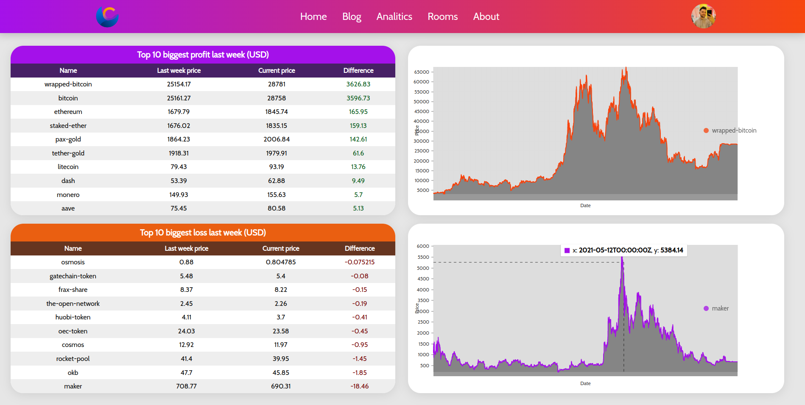
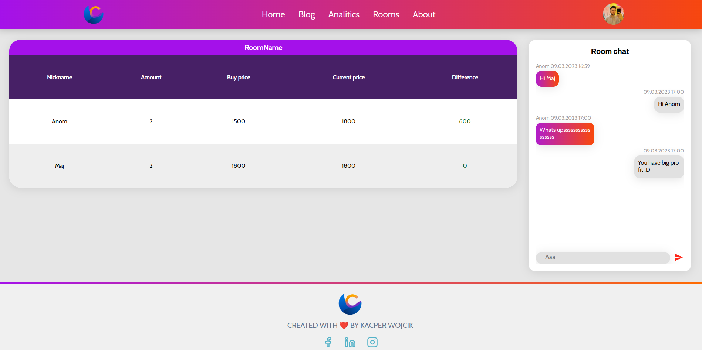

# CryCom - CryCom.eu (under development)

    

A web application that allows creating rooms and comparing
profit on cryptocurrencies with friends

### Technologies: ###
* Python, Django, Django REST framework, Docker-compose
* PostgreSQL, InfluxDB (in the future)
* ReactJS, Javascript, HTML, CSS

## Description ##
The App is running on the server OVH (currently down), with domen crycom.eu.
With docker-compose was created 7 containers - 3 for purposes of celery and 2 for PostgreSQL and InfluxDB, 2 for Django and react servers. Celery workers take care of scheduled tasks and update the database to always get the newest data.

Crycom allows users to create rooms and join them. In every room user can add their cryptocurrencies to the table and compare his profit or loss with other roommates. Chat will spice things up, and you will have a chance to tease your friend. Home page shows you top 10 biggest profits and losses from last week in the table and two extreme in the charts.

### Login and register page ###

    
    

### Welcome page with placeholder images ###

 
    
    
    

### Home page shows biggest profit and loss last week ###

 
    

### Rooms page allows create, join, and go to specific room ###

    
    

### Room page allows add cryptocurrencies to the table and chat with roommates (not implemented) ###

    

